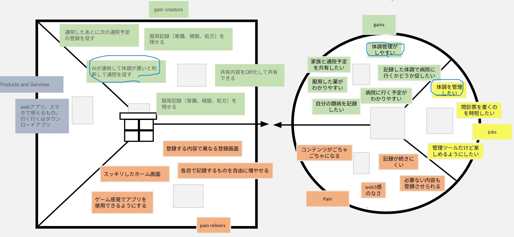

# VPC v1 - mimi_tab_space

> 「**自分や周りの人を顧客に設定**」したVPC。13週後の自分が欲しいもの・身近な人のために作りたいものを設計する。
> v1 でいい。完璧を目指さない。第6回でアップデート(v2)します。

---

## 1. 解決したい困りごとを 1つ 選ぶ

**選んだ困りごと**: 体調が安定しない（バグリスト No.3）

---

## 2. その解決策のアイデアを書く

**解決のアイデア**: 体調・服薬・通院予定をまとめて記録・管理できるwebアプリ。AIが体調の悪化を検知して通院を促す。

---

## 3. VPC本体

### 🟦 Customer Profile（顧客=自分自身）

#### Jobs（やりたいこと・動詞で書く）

- 体調を管理したい
- 問診票を書くのを時短したい
- 管理ツールだけど楽しめるようにしたい

#### Pains（困っていること）

- コンテンツがごちゃごちゃになる
- 記録が続きにくい
- 必要ない内容も登録させられる
- web3感のなさ

#### Gains（得たい未来・状態）

- 体調管理がしやすい
- 家族と通院予定を共有したい
- 服用した薬がわかりやすい
- 記録した体調で病院に行くかどうか促したい
- 病院に行く予定がわかりやすい
- 自分の闘病を記録したい

---

### 🟧 Value Map（あなたが作るもの）

#### Products & Services

- webアプリ・スマホで使えるもの。将来的にはダウンロードアプリ

#### Pain Relievers

- 登録する内容で異なる登録画面（ごちゃごちゃ解消）
- 服用記録（常備・頓服・処方）を残せる
- スッキリしたホーム画面
- 各自で記録するものを自由に増やせる
- ゲーム感覚でアプリを使用できるようにする（継続しやすく）

#### Gain Creators

- 通院したあとに次の通院予定の登録を促す
- 服用記録（常備・頓服・処方）を残せる
- 共有内容をQR化して共有できる
- AIが連続して体調が悪いと判断して通院を促す

---

## 4. Fit確認（整合チェック）

| Pains/Gains | ↔ | Pain Relievers / Gain Creators | チェック |
|---|---|---|---|
| コンテンツがごちゃごちゃになる | ↔ | 登録する内容で異なる登録画面 / スッキリしたホーム画面 | ✓ |
| 記録が続きにくい | ↔ | ゲーム感覚でアプリを使用できるようにする | ✓ |
| 必要ない内容も登録させられる | ↔ | 各自で記録するものを自由に増やせる | ✓ |
| 体調管理がしやすい | ↔ | AIが連続して体調が悪いと判断して通院を促す | ✓ |
| 家族と通院予定を共有したい | ↔ | 共有内容をQR化して共有できる | ✓ |
| 服用した薬がわかりやすい | ↔ | 服用記録（常備・頓服・処方）を残せる | ✓ |

> 整合しないものは「自分が作りたいだけ」のプロダクトになりがち。
> 迷ったら AI大学講師に壁打ち。
